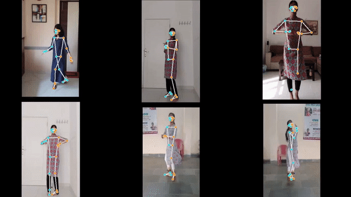

# Mapping Of Kathak Dance Steps 

    

An intriguing application of human action recognition to dance style, specifically to the classical Indian dance form "Kathak." The goal of this work is the development of an impartial system that can evaluate a dancer's moves without human interference.

The data folder has the test and the train data. There is data related to 3 dance steps. Pre-processing steps has already been applied on the video data. This includes triming single video in which the step is repeated multiple times and separating the individual steps. Later each video is converted into a numpy array consisting of 30 frames in each video and 50 features in each frame.

The data folder has .npy files for each step. The numpy file is a 3D numpy array where every row is a video file containg the a single step. The number of frames in each video is arranged along the column and every column is composed of 50 features that represnts pose embedding of the body landmark in that particular frame.

We have taken a reference video of the same dance step being performed and used it to evaluate the other films the artist has posted of themselves performing the same dance step. We can replace the foundational video with a method that focuses just on the joint motion throughout the dance step, using the angles formed during the action in question. In the future, this can be adjusted to account for mathematical equations and the associated curves.
